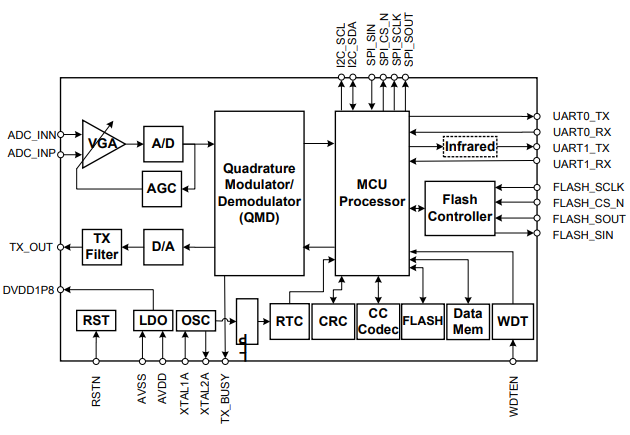

# [HT8550](https://github.com/SoCXin/HT8550)

* [hitrendtech](http://www.hitrendtech.com/): [8051](https://github.com/SoCXin/8051)
* [L1R3](https://github.com/SoCXin/Level): 20 MHz

## [简介](https://github.com/SoCXin/HT8550/wiki)

[HT8550](https://github.com/SoCXin/HT8550) 高性能电力线载波通信芯片，采用先进的数模混合设计技术与工艺，提供
低功耗、高灵敏度、高抗干扰能力的电力线数据通信，可实现各种类型的数据传输及远程抄
表应用。HT8550是高集成度SOC芯片，它将模拟前端、数字调制解调、基带数据处理和8051
MCU以及FLASH存储器等模块完全在单芯片上实现。

### 关键特性

* 8KB SRAM，128KB FLASH
* DPSK调制方式、高效可靠的前向纠错技术、可灵活配置的传输模式
* 0.162um CMOS工艺
* DBPSK，DQPSK，D8PSK
* LQFP48

### [资源收录](https://github.com/SoCXin)

* [参考资源](src/)
* [相关文档](docs/)
* [典型应用](project/)
* [Xin文档](https://docs.soc.xin/HT8550)

### [选型建议](https://github.com/SoCXin)

[HT8550](https://github.com/SoCXin/HT8550)最新型号HT8580是一款支持DPSK调制方式的高性能电力线载波通信芯片，采用先进的数模混合设计工艺。HT8580是集低功耗、高灵敏度、低带外干扰的电力线载波通信芯片，可实现各种类型的数据传输及远程抄表应用。HT8580是高集成度SOC芯片，它将模拟前端、数字调制解调、基带数据处理和8051 MCU以及FLASH存储器等模块完全在单芯片上实现。支持多种外围接口，并能够完成MAC层及以上协议层所需各种功能及应用。

HT8580支持多种模式及双载波发送与接收，包括通信的载波频率、双载波间隔、传输速率以及调制方式均可灵活配置。HT8580内部集成12bit高精度ADC、45dB动态范围信号放大器、自动增益控制环路，使模拟信号接收处理得到进一步优化；内置10比特DAC及低通滤波器，使得发送时产生的带外干扰得以抑制，HT8580支持时域分集接收技术可有效提高对抗电力线脉冲干扰能力；支持双载波频域分集模式可增强对抗频域窄带干扰性能。HT8580内部采用高效可靠的前向纠错技术、可灵活配置的传输模式，使其可以在各种不同噪声的电力线环境下实现自适应可靠通信。

### [探索芯世界 www.SoC.Xin](http://www.SoC.Xin)
